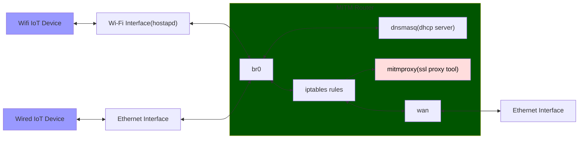

# mitmrouter
Bash script to automate setup of Linux router useful for IoT device traffic analysis and SSL mitm




## Dependancies

- hostapd
- dnsmasq
- bridge-utils
    - provides `brctl`
- net-tools
    - provides `ifconfig`

## Usage

You may want to disable NetworkManager as it may fight for control of one or more of the network interfaces.

Before running the script, you will need to edit the bash variables at the top of the script to use your machines interface names and other details you may want to change like the Wi-Fi network SSID and password.

```
./mitmrouter.sh: <up/down>
```

The `./mitmrouter.sh up` command will bring down all the linux router components and then build them back up again

The `./mitmrouter.sh down` command will bring down all the linux router components


